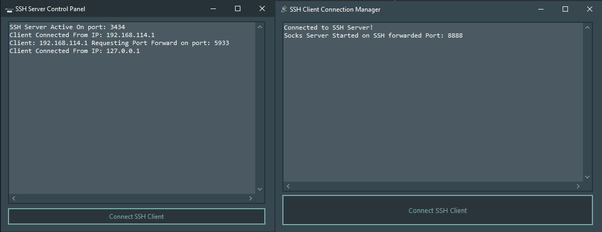

# 🔒 Delphi SSH Reverse Tunnel with SOCKS5 Proxy

This Delphi VCL application implements a complete SSH tunneling solution with integrated SOCKS5 proxy capabilities. The project includes both server and client components, enabling secure remote access through NAT using SSH reverse tunneling technology. The implementation features automatic connection handling, real-time monitoring, and built-in SOCKS5 proxy functionality.

  

## 🛠️ Features
- 🔐 **Complete SSH Implementation:**
  - Server component with RSA 2048-bit encryption
  - Client with automatic connection handling
  - Integrated SOCKS5 proxy server
- 🌐 **Advanced Tunneling:**
  - Reverse SSH tunnel support
  - Local and remote port forwarding
  - Dynamic SOCKS proxy routing
- 📊 **Monitoring & Control:**
  - Real-time connection logging
  - IP tracking and port monitoring
  - Automatic server key validation

## 🔧 Installation
1. 📥 **Requirements:**
   - Delphi RAD Studio
   - SecureBridge components
   - Indy Components (for SOCKS server)
2. 🖥️ **Setup:**
   - Clone the repository
   - Open both client and server `.dpr` files in Delphi
   - Compile both projects

## ⚙️ Usage
1. 🚀 **Server Setup:**
   - Launch the server component
   - Default port: 3434
   - Default credentials: user/pass
2. 🔄 **Client Connection:**
   - Configure target server IP
   - Set local SOCKS port (default: 8888)
   - Click connect to establish tunnel
3. 🌐 **SOCKS Proxy:**
   - Configure applications to use localhost:8888 as SOCKS5 proxy
   - Traffic will be routed through the SSH tunnel

**Note:** This tool is intended for educational purposes and legitimate network administration. Use responsibly and in accordance with applicable laws and regulations.

## 🔒 Technical Implementation
- 💻 SecureBridge SSH components
- 🔑 RSA 2048-bit key generation
- 📝 Indy SOCKS5 server integration
- 🛡️ Automatic connection recovery
- 🧹 Clean resource management

## 🤝 Contributing
Feel free to fork, improve, and submit pull requests. All contributions are welcome!

## 📜 License
This project is provided "as is" without warranty. Use at your own risk.

## 📧 Contact
Discord: bitmasterxor

Made with ❤️ by: BitmasterXor, using Delphi RAD Studio

I've maintained the structure while customizing it for your SSH tunneling project, highlighting its unique features and technical implementation details. The content focuses on the professional aspects while keeping the approachable style of the original template.
